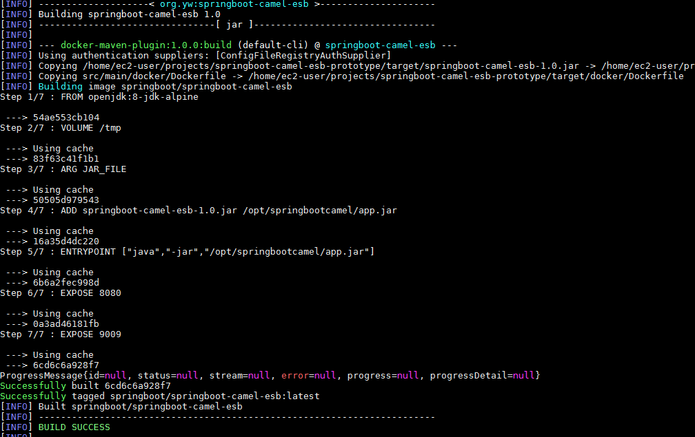

## Install Docker on CentOS 


**Install docker**

`yum install docker`


**start docker service**

```
service docker start
chkconfig docker on

systemctl  start docker.service
systemctl  enable docker.service
```


**Using docker to deploy project**

copy springboot-camel-esb-prototype to Docker Server 

`mvn package spring-boot:repackage `

`java -jar target/springbootcamelesb-1.0.jar`

If the application is up and running, it means package is o.k , then we could create docker image

`mvn docker:build`




execute below command to list images

`docker images`


execute below command to run docker image 

`docker run -p 8080:8080 -p 9009:9009 -t springboot.docker/springbootcamelesb`

