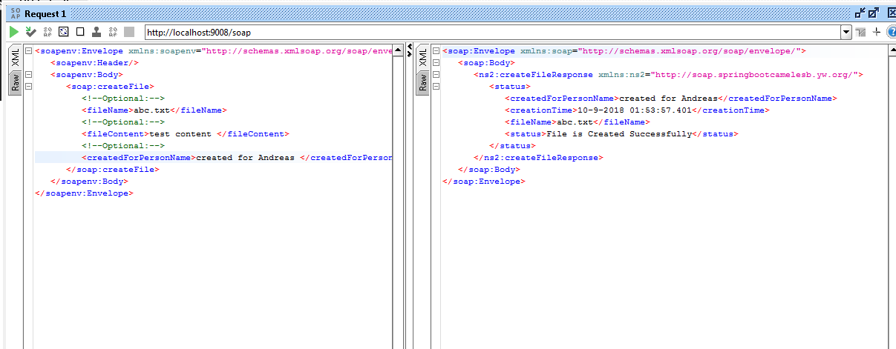

== Camel Example Spring Boot

This example shows how to work with a simple Apache Camel application using Spring Boot.

The example has two endpoints , one is soap another is file , a soap request will generate a file

=== Camel routes

The Camel route is located in the `CamelRouteBuilder` class. 

=== Using Camel components

=== How to run

You can run this example using

    mvn spring-boot:run

=== To get health check

To show a summary of spring boot health check

----
curl -XGET -s http://localhost:8080/actuator/health
----

=== To get info about the routes

To show a summary of all the routes

----
curl -XGET -s http://localhost:8080/actuator/camelroutes
----

To show detailed information for a specific route

----
curl -XGET -s http://localhost:8080/actuator/camelroutes/{id}/detail

===  SOAP UI Test Result

=== To get Reference

SpringBoot from Zero to Hero https://www.youtube.com/watch?v=aA4tfBGY6jY 
Apache Camel with Spring Boot
https://www.baeldung.com/apache-camel-spring-boot 

https://itnext.io/migrating-a-spring-boot-service-to-kubernetes-in-5-steps-7c1702da81b6
https://spring.io/guides/gs/spring-boot-docker/
http://camel.apache.org/spring-boot.html
https://www.baeldung.com/apache-camel-spring-boot
https://medium.com/@mzimecki/spring-boot-apache-camel-web-service-a90696d8ac36
